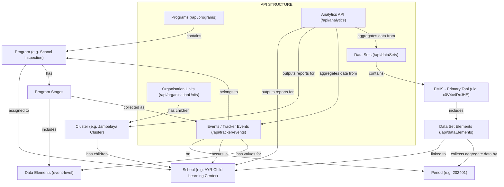

```mermaid
graph TD

%% ORG UNITS
A["Organisation Units (/api/organisationUnits)"]
A1["Cluster (e.g. Jambalaya Cluster)"]
A2["School (e.g. AYR Child Learning Center)"]
A -->|has children| A1
A1 -->|has children| A2

%% DATA SETS
B["Data Sets (/api/dataSets)"]
B1["EMIS - Primary Tool (uid: x0V4c4DxJHE)"]
B -->|contains| B1
B1 -->|includes| B2["Data Set Elements (/api/dataElements)"]
B2 -->|collects aggregate data by| C1["Period (e.g. 202401)"]
B2 -->|linked to| A2

%% PROGRAMS & STAGES
C["Programs (/api/programs)"]
C1A["Program (e.g. School Inspection)"]
C -->|contains| C1A
C1A -->|has| C2["Program Stages"]
C2 -->|includes| C3["Data Elements (event-level)"]
C1A -->|assigned to| A2

%% EVENTS
D["Events / Tracker Events (/api/tracker/events)"]
C2 -->|collected as| D
D -->|belongs to| C1A
D -->|has values for| C3
D -->|occurs in| A2
D -->|on| C1

%% ANALYTICS
E["Analytics API (/api/analytics)"]
E -->|aggregates data from| B
E -->|aggregates data from| D
E -->|outputs reports for| A1
E -->|outputs reports for| A2

%% RELATIONSHIPS SUMMARY
subgraph "API STRUCTURE"
A
B
C
D
E
end
```